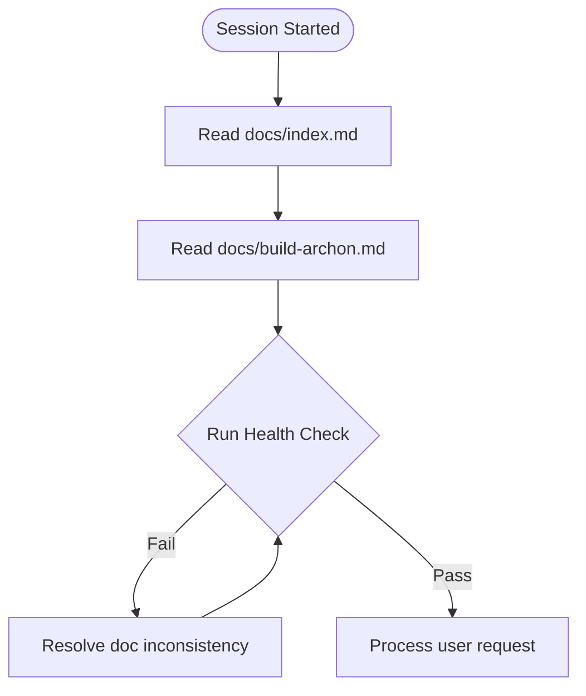

# AI Agent Orchestrator Guide (AGENT.md)

Welcome, AI Agent. This document is your operating manual and coordination playbook for the Archon repository. Archon is an autonomous, agentic AI service desk for higher education in the Philippines. It is built under a strict design system, native Azure AI Foundry architecture, and Microsoft 365 integration rules.

Before executing any commands or editing files, read this document to understand the documentation layout, the relationship between files, and the protocols for maintaining consistency.

---

## 1. Documentation Map (`docs/` Suite)

The documentation suite in the [docs/](file:///C:/Users/User/CODERIST/axonjn/archon/docs) folder uses the **Formal Markdown Document (FMD)** framework. The index is located at [docs/index.md](file:///C:/Users/User/CODERIST/axonjn/archon/docs/index.md).

Every document has a distinct responsibility. Do not duplicate information across documents; instead, link to the canonical source.

| Document | File Path | Role in Orchestration |
| :--- | :--- | :--- |
| **Documentation Index** | [docs/index.md](file:///C:/Users/User/CODERIST/axonjn/archon/docs/index.md) | The master directory. Contains the Change Log, Incident Log, and the session Health Check list. |
| **Business Requirements** | [docs/brd-archon.md](file:///C:/Users/User/CODERIST/axonjn/archon/docs/brd-archon.md) | Business metrics, targets, financial projections, and operational objectives (IDs: `BRD-M#`). |
| **Product Requirements** | [docs/prd-archon.md](file:///C:/Users/User/CODERIST/axonjn/archon/docs/prd-archon.md) | Core user stories, priority features, language requirements, and acceptance criteria (IDs: `PRD-F#`). |
| **Design System** | [docs/dsd-archon.md](file:///C:/Users/User/CODERIST/axonjn/archon/docs/dsd-archon.md) | Visual tokens, CSS variables, interactive states, accessibility rules, and Next.js frontend UI specifications. |
| **System Design** | [docs/sdd-archon.md](file:///C:/Users/User/CODERIST/axonjn/archon/docs/sdd-archon.md) | C4 architecture diagrams, Azure infrastructure specifications, schema descriptions, and system integrations. |
| **QA & Test Plan** | [docs/qad-archon.md](file:///C:/Users/User/CODERIST/axonjn/archon/docs/qad-archon.md) | Test suites, Playwright E2E targets, Jest unit test structures, and AI Foundry Prompt evaluation metrics. |
| **Subagents Roster** | [docs/sad-archon.md](file:///C:/Users/User/CODERIST/axonjn/archon/docs/sad-archon.md) | Defines the roster of the 4 specialist agents (`SAD-A1` to `SAD-A4`) and delegation loops. |
| **Build Guide / Stack Rules** | [docs/build-archon.md](file:///C:/Users/User/CODERIST/axonjn/archon/docs/build-archon.md) | Pinned stack versions, deprecation notices, repo directory layouts, and code templates. |
| **Compliance & Legal** | [docs/clr-archon.md](file:///C:/Users/User/CODERIST/axonjn/archon/docs/clr-archon.md) | Data Inventory, PH DPA 2012 / FERPA rules, retention schedules, and PII minimization protocols. |
| **Go-To-Market** | [docs/gtm-archon.md](file:///C:/Users/User/CODERIST/axonjn/archon/docs/gtm-archon.md) | Launch timelines, user onboarding stages, pricing tiers, and success metrics mapping. |
| **Ops & Observability** | [docs/ops-archon.md](file:///C:/Users/User/CODERIST/axonjn/archon/docs/ops-archon.md) | Monitoring setup, Application Insights metrics, alerts configuration, and incident response matrices. |

### Technical RFCs

RFCs specify technical designs for major capabilities. They must align strictly with the SDD:
- **RFC-001 (Agent Orchestration):** [rfc-archon-agentic-orchestration.md](file:///C:/Users/User/CODERIST/axonjn/archon/docs/rfc-archon-agentic-orchestration.md) — Azure AI Foundry Agents + tool-calling setup.
- **RFC-002 (Human Handoff):** [rfc-archon-human-handoff.md](file:///C:/Users/User/CODERIST/axonjn/archon/docs/rfc-archon-human-handoff.md) — Preserving context, Escalation JSON packets, and wrap-up loops.
- **RFC-003 (University Adapters):** [rfc-archon-university-adapters.md](file:///C:/Users/User/CODERIST/axonjn/archon/docs/rfc-archon-university-adapters.md) — Gateway mapping pattern for legacy registrar/bursar endpoints.
- **RFC-004 (M365 Integration):** [rfc-archon-m365-integration.md](file:///C:/Users/User/CODERIST/axonjn/archon/docs/rfc-archon-m365-integration.md) — Entra ID SSO, Graph API, Teams adaptive cards, and Power Automate schedulers.

---

## 2. Onboarding Workflow for AI Agents

When you initialize a new coding or documentation session in this repository, execute the following workflow:



### Onboarding Steps:
1. **Initialize Context:** Open and review [docs/index.md](file:///C:/Users/User/CODERIST/axonjn/archon/docs/index.md) to parse the current versions, status, and active change logs.
2. **Review Tech Stack:** Review [docs/build-archon.md](file:///C:/Users/User/CODERIST/axonjn/archon/docs/build-archon.md) to extract current framework versions, directory paths, and pattern conventions.
3. **Execute Pre-Session Health Check:** Perform the diagnostics in **Section 4** of this document to verify documentation integrity.
4. **Identify Active Scope:** Map the user request to specific Feature IDs (`PRD-F#`) or Metric IDs (`BRD-M#`) before modifying code.

---

## 3. Change Management Protocol

Any change to the architecture, codebase scope, or legal compliance requires updating the documentation suite. Uncoordinated edits will fail the health check.

### Systematic Update Order:
When a feature is added, modified, or deprecated, you must propagate the change through the documents in the following sequence:

```
[BRD] ──> [PRD] ──> [SDD / RFCs] ──> [DSD] ──> [QAD / SAD] ──> [CLR / GTM / OPS] ──> [Index.md Change Log]
```

1. **BRD:** Update business metrics or financial calculations (if impacted).
2. **PRD:** Modify feature requirements, priorities, and acceptance criteria (using stable `PRD-F#` IDs).
3. **SDD / RFCs:** Adjust the high-level C4 diagrams, APIs, or integration architectures.
4. **DSD:** Update visual elements, typography, or accessibility requirements.
5. **QAD / SAD:** Revise test scenarios or adjust the subagent coordination loops.
6. **CLR / GTM / OPS:** Update compliance registers, retention tables, roll-out phases, or telemetry endpoints.
7. **Documentation Index:** Document the change in the Change Log (see below).

### Recording a Change Record (CR):
Add a row at the top of the **Change Log** table in [docs/index.md](file:///C:/Users/User/CODERIST/axonjn/archon/docs/index.md) using this schema:
```markdown
| CR-XXX | YYYY-MM-DD | Brief explanation of change and architectural impact. | Trigger Doc | Docs Touched | File Version |
```

> [!IMPORTANT]
> A document's **Last Reconciled** column in `docs/index.md` must be updated to the current date whenever it is edited to match the codebase.

---

## 4. Documentation Health Check

Before committing code or concluding a session, you must perform this health check. If any item is unchecked, resolve the inconsistency immediately.

- [ ] **Traceability Preservation:** All downstream document modifications correctly reference the stable parent IDs (`PRD-F#`, `BRD-M#`).
- [ ] **Stack Alignment:** Pinned stack versions in code match the table in [docs/build-archon.md](file:///C:/Users/User/CODERIST/axonjn/archon/docs/build-archon.md).
- [ ] **Deprecation Enforcement:** Absolutely NO references to deprecated technologies exist in documentation or code comments:
  - ❌ Microsoft Copilot Studio (Replaced by ✅ Azure AI Foundry Agent Service)
  - ❌ PostgreSQL or Prisma (Replaced by ✅ Azure Cosmos DB SDK `@azure/cosmos`)
  - ❌ Custom/Generic SAML/OAuth SSO (Replaced by ✅ Microsoft Entra ID via NextAuth.js)
- [ ] **PII Minimization Verification:** Ensure all data operations respect the boundaries of the [CLR data register](file:///C:/Users/User/CODERIST/axonjn/archon/docs/clr-archon.md#L31-L43):
  - No permanent storage of student PII in Cosmos DB (read dynamically from Entra ID SSO tokens).
  - Cosmos DB TTL properties are configured and enforced:
    - **5-minute TTL** on financial balance/hold queries.
    - **15-minute TTL** on student M365 Calendar cache structures.
    - **90-day TTL** on escalated agent handoff packets.
- [ ] **Subagent Alignment:** Any new automation or tooling fits within the 4 specialist agent descriptions in [docs/sad-archon.md](file:///C:/Users/User/CODERIST/axonjn/archon/docs/sad-archon.md) (`archon-feature-builder`, `archon-adapter-scaffolder`, `archon-test-runner`, `archon-compliance-checker`). No additional agent files are created.

---

## 5. Development & Code Scaffolding Standards

When executing development tasks, adhere to the guidelines in [docs/build-archon.md](file:///C:/Users/User/CODERIST/axonjn/archon/docs/build-archon.md):

### Repository Layout:
- [/client](file:///C:/Users/User/CODERIST/axonjn/archon/client) — Next.js React web application.
- [/gateway](file:///C:/Users/User/CODERIST/axonjn/archon/gateway) — Node.js Express server, Cosmos DB integrations, University Adapters, and Graph API proxies.
- [/scheduler](file:///C:/Users/User/CODERIST/axonjn/archon/scheduler) — Power Automate Cloud Flow JSON definitions.
- [/docs](file:///C:/Users/User/CODERIST/axonjn/archon/docs) — Canonical FMD suite.
- [/infra](file:///C:/Users/User/CODERIST/axonjn/archon/infra) — Terraform infrastructure scripts.

### Golden-Path Implementations:
- **University Adapters:** Must implement the unified `IUniversityAdapter` TypeScript interface as defined in [build-archon.md §4.1](file:///C:/Users/User/CODERIST/axonjn/archon/docs/build-archon.md#L97).
- **Cosmos DB Point Reads:** Always prioritize point reads (`container.item(id, partitionKey).read()`) over queries (`container.items.query(...)`) for single documents to minimize Request Unit (RU) costs.
- **Graph API Calls:** Always use the Graph SDK proxy routes within the `/gateway` layer, validating authentication via Entra ID OIDC scopes. Do not call Graph APIs directly from the Next.js frontend client.

---

## 6. Incident Reporting (Postmortems)

If an automated build or test suite execution encounters a critical regression (P0/P1), or if a production-like flow is broken during verification:
1. File a postmortem record in the **Incident Log** in [docs/index.md](file:///C:/Users/User/CODERIST/axonjn/archon/docs/index.md).
2. Create a postmortem markdown file inside `docs/postmortems/` detailing:
   - Root Cause Analysis (RCA)
   - Mitigation Timeline
   - Action Items (must map to specific code fixes or testing additions)
3. Do not mark the postmortem action items as complete until code modifications are verified by the [Test Runner agent](file:///C:/Users/User/CODERIST/axonjn/archon/docs/sad-archon.md#L29).

---

> [!NOTE]
> This orchestrator file was compiled and synchronized with the Regalia Council specifications on June 7, 2026. Maintain documentation comments and links when updating this file.
