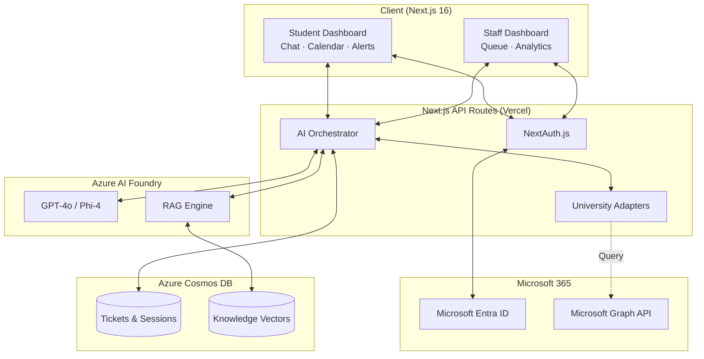

# Archon

<div align="center">

**Agentic AI-Powered Service Desk for Higher Education.**

An autonomous, agentic AI service desk designed specifically for Philippine universities — eliminating the student experience deficit by bridging fragmented bureaucracy across Registrar, Bursar, and Financial Aid departments.

<p>
  
  
  
  
</p>

</div>

---

## Problem

Students at Philippine universities face an "experience deficit" when navigating fragmented university bureaucracy. A single issue—like a delayed enrollment or a financial hold—often requires visiting multiple offices, leading to misrouted inquiries and frustration. Existing solutions are either static FAQ chatbots that cannot resolve account-specific issues, or ticketing systems that still require human intervention for routine inquiries.

---

## Vision

**Stop making students navigate the org chart.**

Archon is an autonomous agent capable of directly interacting with internal university APIs to read status, diagnose complex cross-departmental issues, and synthesize clear, actionable responses in multiple languages (English, Filipino, Cebuano). It resolves the issue before a human agent ever needs to see it.

---

## Purpose

Project Archon is part of an initiative to modernize student services. By orchestrating data across siloed legacy systems into a unified conversational interface, Archon reduces cost-per-ticket by up to 79% while dramatically improving student satisfaction and operational efficiency.

---

## Target Users

- **Primary — University Students:** Needing immediate, context-aware answers to enrollment, financial, and academic advising issues without waiting in line or guessing which department to email.
- **Secondary — Support Staff & Administrators:** Receiving only complex, escalated tickets with structured handoff packets, allowing them to focus on high-value human interactions rather than repetitive triage.

---

## Features

- **Agentic Chat Interface** — Conversational helpdesk with real-time streaming responses (SSE) in Filipino, English, and Cebuano.
- **Cross-Department Data Orchestration** — AI agent queries registrar, bursar, financial aid, and academic advising systems simultaneously via unified adapters.
- **Autonomous Ticket Resolution** — Zero-touch resolution for routine Tier 1 inquiries with AI confidence scoring.
- **Seamless Human Handoff** — Context-preserving escalation with structured handoff packets and AI-recommended resolutions.
- **SAP Appeal Wizard** — Guided step-by-step workflow for Satisfactory Academic Progress appeal submission with pre-fill.
- **CSAT Tracking** — Post-resolution student satisfaction scoring and feedback collection.
- **Proactive Alert System** — Deadline countdown, financial summary, and Power Automate webhook callbacks for Teams/Outlook delivery.
- **Mock Data Presentation** — Deterministic archetype-based student scenario generation for demo and development.
- **Agent Dashboard** — Real-time queue management for support staff with AI-suggested responses.
- **Admin Analytics** — System telemetry, cost-per-ticket trends, and deflection rate dashboards.

---

## Tech Stack

| Layer | Technology |
| --- | --- |
| **Frontend & Backend** | Next.js 16 (App Router), React, TypeScript 5, Tailwind CSS 4 |
| **AI Orchestration** | Azure AI Foundry (GPT-4o, Phi-4) |
| **Database & Search** | Azure Cosmos DB for NoSQL (Vector Search) |
| **Identity & Auth** | Microsoft Entra ID (OIDC) via NextAuth.js |
| **M365 Integration** | Microsoft Graph API, Power Automate |
| **Hosting** | Vercel (Serverless Functions + Edge) |

---

## Architecture

### System Flow



### Directory Structure

```
archon/
├── docs/                     Product documentation
│   ├── index.md              Documentation Index
│   ├── brd-archon.md         Business requirements
│   ├── prd-archon.md         Product requirements
│   ├── sdd-archon.md         System design
│   ├── dsd-archon.md         Design system
│   ├── gtm-archon.md         Go-to-market strategy
│   ├── clr-archon.md         Compliance & legal readiness
│   └── rfc-archon-*.md       Feature RFCs
│
├── client/                   Next.js monolith (Frontend + API Routes)
│   ├── src/
│   │   ├── app/              Next.js App Router (Student & Admin dashboards)
│   │   ├── components/       React UI components
│   │   ├── lib/              Shared utilities, Auth, AI Orchestration
│   │   └── api/              API Routes for AI, webhooks, and university adapters
│   ├── public/               Static assets
│   └── package.json          Dependencies
│
├── AGENT.md                  AI Agent Playbook
├── GEMINI.md                 Gemini Agent Config
└── README.md                 ← You are here
```

---

## How to Run Locally

### Prerequisites

- **Node.js 20+**
- **npm**

### Setup

```bash
cd client
npm install
cp .env.example .env.local
# Configure Entra ID and Azure AI Foundry credentials in .env.local
npm run dev
```

Open [http://localhost:3000](http://localhost:3000).

---

## Deployment

### Vercel

Archon is deployed as a Next.js full-stack monolith on Vercel.

- **Frontend & API Routes:** Vercel (Serverless Functions + Edge)
- **Environment Variables:** Configured in Vercel project settings.

### Azure Services

- **Azure AI Foundry:** Provisioned in the primary Azure subscription for model inference and RAG.
- **Azure Cosmos DB:** Serverless NoSQL deployment for session states and vector storage.
- **Microsoft Entra ID:** App Registration required with `Calendars.Read` Graph API scope.

---

## Team

**Team Name:** Axon Enjin

| Name | GitHub |
| --- | --- |
| Carlos Jerico Dela Torre | [@delatorrecj](https://github.com/delatorrecj) |
| Rhandie Sales Jr. | [@r0undy](https://github.com/r0undy) |
| Aidan Tiu | [@aidantiu](https://github.com/aidantiu) |

---

## Security & Privacy

Archon is designed with Philippine Data Privacy Act (DPA 2012) compliance at its core.
- The AI has **Read-Only** access by default.
- Any write-actions (e.g., lifting holds) require explicit Human-in-the-Loop (HITL) confirmation.
- Robust Prompt Injection filters and Role-Based Access Control (RBAC) enforce student data isolation.
- Microsoft Entra ID enforces identity; no credentials are stored by Archon.
- Microsoft Graph API access is governed by tenant-level admin consent and least-privilege OAuth scopes.

---

## Why Azure AI?

| Primitive | How Archon Uses It |
| --- | --- |
| **Azure AI Foundry** | Unified platform for model deployment, prompt engineering, and evaluation, eliminating the need for fragmented third-party orchestration tools. |
| **Azure Cosmos DB** | Native NoSQL and vector search capabilities in a single database, perfect for storing both structured tickets and unstructured RAG embeddings. |
| **Microsoft Entra ID** | Seamless integration with existing university identity providers, ensuring zero friction for student login. |
| **Microsoft Graph** | Direct access to M365 Calendars and Teams, allowing Archon to push notifications and schedules where students already spend their time. |

---

## License

MIT — © 2026 Axon Enjin
