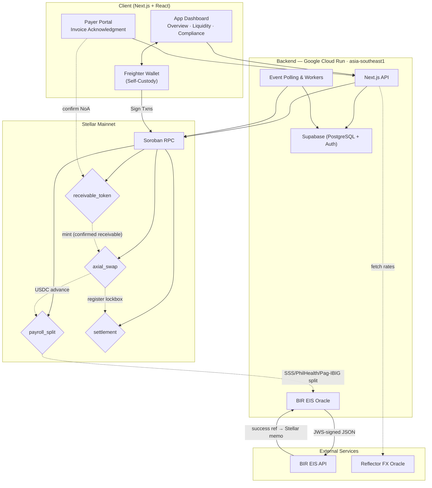
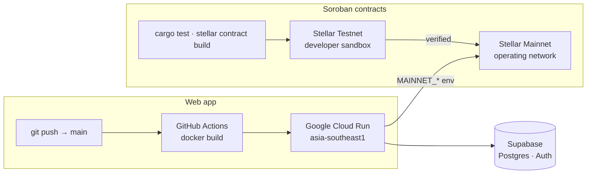

# Axial

<div align="center">

**Instant Capital, Invisible Compliance.**

A Stellar/Soroban-powered liquidity and compliance engine for Philippine MSMEs — tokenize receivables, fund payroll instantly, and automate BIR EIS tax reporting on a single pipeline.

<p>
  
  
  
  
</p>

</div>

---

## Demo Video

<div align="center">
  <a href="https://youtu.be/6-CpnsPGJK0">
    
  </a>
  <br/>
  <sub>▶ Click to watch the walkthrough on YouTube</sub>
</div>

---

## 🧩 Problem

Philippine B2B MSMEs face a **single structural failure** that surfaces as two compounding crises:

**The Liquidity Trap.** Enterprise buyers enforce Net 60–90 payment terms while Philippine labor law mandates bi-weekly payroll. A growing, profitable agency can face technical insolvency because its cash is locked in receivables while payroll triggers every 14 days. Visa places the formal MSME funding demand in the Philippines at **$221B** against a supply of **$15B** — one of the largest funding gaps in the Asia-Pacific.

**The Compliance Burden.** The BIR Electronic Invoicing System (EIS) mandate — deadline **December 31, 2026** — requires structured JSON invoice transmission with JWS signing within T+3 of every transaction. Meanwhile, statutory payroll (SSS, PhilHealth, Pag-IBIG) remains entirely manual for the 56% of MSMEs still on spreadsheets, with retroactive penalties when contribution brackets change.

Existing accounting tools record the absence of cash — they do not generate it. They record a tax liability — they do not execute the payment. The market needs **financial infrastructure, not another data repository.**

---

## 🌟 Vision

A Philippines where every MSME founder runs their business from a single calm dashboard — payroll is always funded on time, statutory deductions are correct and routed automatically, and BIR compliance happens invisibly in the background. The founder never opens a spreadsheet, a government portal, or a tax calculator again.

Axial is the **central axis** where liquidity and compliance become a single, autonomous machine — so founders step out of the execution trench and focus on growth.

---

## 🎯 Purpose

Built for the **Build on Stellar Philippines Hackathon 2026** (May 18–24), Axial was born from a structured research pass on the Philippine MSME sector. We found that the liquidity trap and the compliance burden are **not independent problems** — they are two faces of the same structural failure. Every liquidity event (invoice settlement, payroll run) triggers a compliance obligation (statutory deductions, BIR EIS reporting). You cannot solve one without solving the other.

We merged tokenized invoice factoring with automated EIS reporting and statutory payroll splitting into a **single Stellar/Soroban pipeline** — because the integration is architecturally inseparable, not two products glued together.

---

## 👥 Target Users

- **Primary — B2B Tech, Creative & Manpower Agencies** (10–50 employees): Digitally native, project-based billing against enterprise clients on Net 60–90 terms. Personally feeling the payroll-vs-receivables timing squeeze.
- **Secondary — Institutional F&B Suppliers & Distributors**: Bulk volume sales to supermarket chains, hotel groups, and restaurant franchises holding payments 90–120 days. Higher invoice volume, longer validation path.

---

## ✨ Features

- **Payer Portal & KYB** — Closed-loop payer verification, Notice of Assignment (NoA) gate, and external portal for enterprise payers to acknowledge invoices before factoring.
- **Tokenized Invoice Factoring** — Mint verified receivables as Stellar Asset Contracts (SAC) on Soroban. Only real, confirmed invoices are fundable.
- **Instant Liquidity via Atomic Swap** — Soroban contract advances ~80–90% of face value in USDC instantly, with holdback reserve and MSME recourse. Denomination-agnostic.
- **Programmable Statutory Payroll Splitting** — Soroban contract calculates and routes exact SSS, PhilHealth, and Pag-IBIG deductions to government wallets in real-time.
- **On-chain Lockbox Settlement** — Smart contracts autonomously manage payer settlements, releasing reserves back to MSMEs and reconciling state automatically.
- **BIR EIS Compliance Oracle** — Off-chain service maps transaction metadata to the 20-field BIR EIS schema, JWS-signs the payload, and submits within T+3. Immutable proof written to Stellar memo.
- **Freighter Wallet Integration** — Full support for self-custody non-custodial signing via Freighter, alongside embedded custodial paths.
- **Auth & Multi-tenancy** — Organization-scoped authentication, Magic Links, and role-based access control powered by Supabase.
- **Event-driven Cron Workers** — Automated T+3 compliance scheduling and Horizon event polling for autonomous system state reconciliation.
- **PHP-Denominated UX** — All amounts displayed in Philippine Pesos. Settlement in USDC on Stellar. Real-time FX conversion via Reflector oracle integration.

---

## 🛠️ Tech Stack

| Layer | Technology |
| --- | --- |
| **Smart Contracts** | Rust, Soroban SDK, WASM (4 crates: `receivable_token`, `axial_swap`, `payroll_split`, `settlement`) |
| **Frontend** | Next.js 15 (App Router), React 19, TypeScript 5, Tailwind CSS 4 |
| **Backend** | Next.js API Routes, scheduled cron workers, BIR EIS Oracle |
| **Database & Auth** | Supabase (PostgreSQL, Row Level Security, Auth / Multi-tenancy) |
| **Blockchain** | Stellar (Soroban smart contracts, Horizon API, Stellar SDK) |
| **Settlement** | USDC on Stellar (Circle-issued) |
| **Wallets** | Freighter Integration (Self-custody) |
| **Design** | Dark glassmorphic, Geist typography, Material Symbols |
| **Hosting** | Google Cloud Run (`asia-southeast1`), GitHub Actions CI |

---

## Architecture

### System Flow



### Build & Deploy

Contracts are tested and dry-run on **Testnet** (a developer sandbox), then deployed to **Mainnet** — the operating network. The web app ships via GitHub Actions → Google Cloud Run.



### Smart Contracts (Soroban)

| Contract | Responsibility | Status |
| --- | --- | --- |
| `receivable_token` | SAC mint — `initialize`, `mint`, `is_minted`, `get_receivable`. One mint per confirmed invoice. | ✅ Testnet + Mainnet |
| `axial_swap` | USDC atomic swap — advance vs receivable token. Denomination-agnostic asset param, configurable advance bps, reserve + discount. | ✅ Testnet + Mainnet |
| `payroll_split` | Statutory payroll router — `initialize`, `quote`, `route_payroll`, `get_payroll`. USDC split to SSS / PhilHealth / Pag-IBIG + net to employees. | ✅ Testnet + Mainnet |
| `settlement` | Lockbox & Reconciliation — `initialize`, `register_invoice`, `settle`, `report_leakage`, `get_lockbox`. Receives payer funds, repays funder, routes reserve to MSME. | 🟡 Testnet + Mainnet — app wiring (B-2 S3–S6) pending |

**Happy-path call order:**

```
Payer Portal (off-chain) → receivable_token::mint
  → axial_swap::execute_advance
  → payroll_split::route_payroll
  → oracle submits EIS + memo (off-chain)
  → settlement::register_invoice (after advance) → settlement::settle (on payer payment)
```

### Directory Structure

```
axial/
├── docs/                     Product documentation
│   ├── Axial.md              Canonical foundation document
│   ├── brd-axial.md          Business requirements
│   ├── prd-axial.md          Product requirements
│   ├── sdd-axial.md          System design
│   ├── dsd-axial.md          Design system
│   ├── gtm-axial.md          Go-to-market strategy
│   ├── clr-axial.md          Compliance & legal readiness
│   ├── flow.md               Visual flow diagrams
│   └── rfc-axial-*.md        Feature RFCs
│
├── soroban/                  Soroban smart contracts (Rust)
│   ├── contracts/
│   │   ├── receivable_token/ SAC mint (payer-confirmed receivable)
│   │   ├── axial_swap/       USDC atomic swap + reserve
│   │   ├── payroll_split/    SSS / PhilHealth / Pag-IBIG routing
│   │   └── settlement/       Payer lockbox & reconciliation
│   ├── scripts/              Deploy & demo scripts
│   ├── deployments/          Testnet/Mainnet contract IDs
│   ├── Makefile              build, test, deploy targets
│   └── CONTRACTS.md          Contract map
│
├── web/                      Next.js frontend
│   ├── app/
│   │   ├── app/              Authenticated app — Overview, Liquidity, Compliance, Settings, Payer Portal
│   │   ├── (auth)/           Login & invite routes
│   │   └── api/              API routes (invoices, payroll, wallets, EIS, swap, noa, payers, etc.)
│   ├── components/           UI components (sidebar, overview, liquidity, compliance, settings)
│   └── lib/                  Shared utilities & Stellar SDK integration
│
├── supabase/                 Database schema & migrations
└── README.md                 ← You are here
```

---

## 🚀 How to Run Locally

### Prerequisites

- **Node.js 20+**
- **Rust** + `wasm32-unknown-unknown` target (for smart contracts)
- **Stellar CLI v25+** (install in WSL on Windows)
- **WSL** (required for Soroban contract builds on Windows)

### Frontend

```bash
cd web
npm install
npm run dev
```

Open [http://localhost:3000](http://localhost:3000).

### Smart Contracts (WSL)

```bash
cd soroban
make setup          # configure network + fund test identity
make build          # compile all contracts → WASM
make test           # run unit tests
make deploy-all     # deploy to testnet
```

Or manually:

```bash
stellar contract build
cargo test
```

### Environment Variables

Copy the example files and fill in your values (Supabase credentials, Wallet keys, etc.):

```bash
cp web/.env.example web/.env
cp soroban/.env.example soroban/.env
```

Environment variables are set as GitHub Actions repo vars/secrets for the Cloud Run deploy.

---

## 🌐 Deployment

### Testnet

- **Network:** Stellar Testnet (Soroban RPC)
- **RPC:** `https://soroban-testnet.stellar.org:443`
- **Deployed Contracts** — all 4 on Testnet:
  - **Axial Swap:** [`CDDAIDM4D62OZL5MQPKO5ZFWE7TBRFJD5Y3L2UZKP5OVGP2VHZ2UU736`](https://stellar.expert/explorer/testnet/contract/CDDAIDM4D62OZL5MQPKO5ZFWE7TBRFJD5Y3L2UZKP5OVGP2VHZ2UU736)
  - **Receivable Token:** [`CAQEEFBO44FONQKGCEHR2QFTLOIIO232Z7WM6722ZDA6MNAL2NNU7SOP`](https://stellar.expert/explorer/testnet/contract/CAQEEFBO44FONQKGCEHR2QFTLOIIO232Z7WM6722ZDA6MNAL2NNU7SOP)
  - **Payroll Split:** [`CBJCEJMDGRGLVU7VHAFR2VSVSBIKIWZA6LBQN6SCLZVJU6YROTETY3MB`](https://stellar.expert/explorer/testnet/contract/CBJCEJMDGRGLVU7VHAFR2VSVSBIKIWZA6LBQN6SCLZVJU6YROTETY3MB)
  - **Settlement:** [`CAZ2GTIOW6T7DQZH2CA3IIAWJAV5JJAMXD2XUTPS4BH6OXPFXVMYLL2X`](https://stellar.expert/explorer/testnet/contract/CAZ2GTIOW6T7DQZH2CA3IIAWJAV5JJAMXD2XUTPS4BH6OXPFXVMYLL2X)
- **Demo Wallets:**

| Name | Role | Address |
| --- | --- | --- |
| Admin (deploy + init) | Deployer | `GD67NPG7TKJDE5HEHSPWS3YAWYNHWTLWRSQMTO4NQOVSZAEFPICO3HYG` |
| Treasury (funder) | Pays USDC | `GBRLGRWUJXJSHJDZQ4OH2SDH7ROF7EWAHI4ZIQM2E6TMONH7IG4P7QKL` |
| MSME (receives advance) | Borrower | `GBCVJCRULTHI74CXNP4QFGE6OSK5XFUYIPPEONRNXS3JQSKA26TDAR66` |

### Mainnet

- **Network:** Stellar Mainnet (Soroban RPC)
- **Deployed Contracts:**
  - **Axial Swap:** [`CDAWI7O7XGPCSXDRUUJCKSJNKXIARW4VAV4KD3OBXUBI27Q3OH7PEKUP`](https://stellar.expert/explorer/public/contract/CDAWI7O7XGPCSXDRUUJCKSJNKXIARW4VAV4KD3OBXUBI27Q3OH7PEKUP)
  - **Receivable Token:** [`CALEBRJO7CI3KB24SL2RAP7B76AIRXC6IPQFD2AJK2DK6WXSJBAVGILL`](https://stellar.expert/explorer/public/contract/CALEBRJO7CI3KB24SL2RAP7B76AIRXC6IPQFD2AJK2DK6WXSJBAVGILL)
  - **Payroll Split:** [`CA27UILZDBSHVSO7HUNRQBTMZKDS5SEOYUOVRCGD7DRJWC6LLTDZUSFT`](https://stellar.expert/explorer/public/contract/CA27UILZDBSHVSO7HUNRQBTMZKDS5SEOYUOVRCGD7DRJWC6LLTDZUSFT)
  - **Settlement:** [`CDMHMQNPO7GHJH6YRDCDT2L24SSUVKBOWNOY6F3QRWZRWLSH7G2DDG6K`](https://stellar.expert/explorer/public/contract/CDMHMQNPO7GHJH6YRDCDT2L24SSUVKBOWNOY6F3QRWZRWLSH7G2DDG6K)
- **XLM Wallet Address:** `GB6TMTI6DB6BETQEPMKXOAYAMYKGNHR4AJVZHKEQ5LCVFINGEDQDKCFI`
- **USDC Issuer (Circle):** `GA5ZSEJYB37JRC5AVCIA5MOP4RHTM335X2KGX3IHOJAPP5RE34K4KZVN`

---

## 🎥 Demo

- 🎬 **Demo Video:** [YouTube](https://youtu.be/6-CpnsPGJK0)
- 🔗 **Live App:** [Axial](https://axial.axonenjin.com)
- 🖼️ **Pitch Deck:** [Interactive HTML](docs/pitch-deck.html) | [PDF Export](docs/pitch-deck.pdf)

### Demo Walkthrough

The demo follows this order to showcase the full pipeline:

1. **Overview** — Treasury wallet balances, liquidity metrics, regulatory pulse (BIR EIS sync status, statutory splitting)
2. **Liquidity** — Upload or seed an invoice → confirm payer (via portal) → tokenize receivable (SAC mint) → execute atomic swap (USDC advance to MSME)
3. **Compliance** — Run payroll split (SSS + PhilHealth + Pag-IBIG routing) → trigger BIR EIS oracle → verify JWS-signed submission → success reference written to Stellar memo
4. **Settings** — Wallet integrations (Freighter), environment configuration

---

## 👨‍💻 Team

**Team Name:** Axon Enjin

| Name | Role | GitHub |
| --- | --- | --- |
| Carlos Jerico Dela Torre | Product & Business Architect, Team Lead | [@delatorrecj](https://github.com/delatorrecj) |
| Aidan Tiu | DevOps Engineer | [@ymnw.r](https://github.com/aidantiu)  |
| Gerald Berongoy | Full Stack Engineer | [@geraldsberongoy](https://github.com/geraldsberongoy)  |
| Rhandie Sales Jr. | Full Stack Engineer | [@r0undy](https://github.com/r0undy) |

---

## 📈 Roadmap

| Phase | Focus | Status |
| --- | --- | --- |
| **Phase 1 — Wedge** | Production build on Stellar Testnet/Mainnet. Onboard software/creative agencies. | 🔄 Current |
| **Phase 2 — Validation** | Real operational deployment. Onboarding initial users with Atomic swaps, EIS oracle, and statutory flows in production. | ⬜ Next |
| **Phase 3 — Expansion** | F&B suppliers and distributors. Larger invoice throughput. | ⬜ Planned |
| **Phase 4 — Ad Tax Module** | Programmable treasury for BIR RMC 5-2024 (digital ad tax compliance). | ⬜ Future |

### Post-Hackathon Priorities

| Priority | Item | Rationale |
| --- | --- | --- |
| 🔴 High | BIR PTT certification & production EIS API access | Mandatory for real compliance submissions |
| 🔴 High | Legal sign-off on statutory contribution tables | SSS, PhilHealth, Pag-IBIG brackets must be attorney-reviewed |
| 🔴 High | PDAX Connect API integration (PHP fiat rail) | Production on/off-ramp via SEP-24 anchor |
| 🟡 Medium | Liquidity provider partnership agreements | Determines discount rate structure and funder yield |
| 🟡 Medium | Broader multi-wallet support (Albedo, Lobstr) | Freighter is already integrated; adding alternatives for broader compatibility |

---

## Why Stellar?

| Stellar Primitive | How Axial Uses It |
| --- | --- |
| **Stellar Asset Contracts (SAC)** | Each verified receivable is minted as a SAC — the on-chain representation of the legal right to payment. |
| **Soroban Smart Contracts** | Denomination-agnostic atomic swap, statutory payroll router, and settlement — all in Rust/WASM. |
| **Transaction Memos** | BIR EIS success reference IDs anchored to on-chain finality as immutable compliance proof. |
| **USDC on Stellar** | Circle-issued production settlement asset. No external stablecoin dependencies. |
| **AUTH_REQUIRED / AUTH_REVOCABLE** | Statutory routing contracts enforce that funds flow only to whitelisted government agency addresses. |
| **SEP-24** | Standard anchor interface for PHP fiat on/off-ramp. PDAX as primary driver; architecture supports any anchor. |
| **3–5 Second Finality** | Settlement speed triggers compliance oracle within T+3 window — compliance becomes a background process. |

---

## 📜 License

[MIT](LICENSE) — Build on Stellar Philippines Hackathon 2026 · © 2026 Axon Enjin
