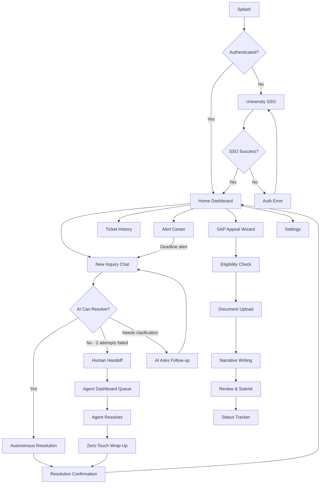

# Product Requirements Document (PRD)

**Project:** Archon — Agentic AI-Powered Service Desk for Higher Education
**Date:** 2026-06-07
**Version:** 0.1
**Owner:** Regalia Council
**Status:** Draft
**Last reconciled:** N/A — not yet reconciled with code
**BRD:** [brd-archon.md](brd-archon.md)

---

## 1. Product Purpose & Value Proposition

Archon is an autonomous AI service desk that resolves university student inquiries across departmental boundaries — without the student being bounced between offices, ghosted by advisors, or forced to micromanage their own support tickets. Powered by a hybrid Copilot Studio + Azure OpenAI architecture, Archon accesses a student's enrollment, financial aid, registration, and billing data through a unified orchestration layer, executes multi-step resolutions autonomously for routine inquiries, and hands off complex cases to human agents with full context preserved. For universities, it transforms the helpdesk from a cost center at ~$104.68 per ticket into a proactive resolution engine at ~$22 per ticket. For students, it replaces anxiety and abandonment with instant, accurate, empathetic support — 24/7, in Filipino and English.

---

## 2. Target Personas

**Primary Persona — Mara (The Anxious Student)**
- *Who they are:* A 20-year-old BS Information Technology student at a state university in the Philippines. Working part-time. Relies on UniFAST/CHED scholarship for tuition. Accesses university services primarily via mobile phone.
- *Their core frustration:* Her financial aid disbursement was delayed without explanation. She received an auto-generated email threatening class de-enrollment. She called the financial aid office — no answer for 3 days. She visited the registrar in person; they redirected her to the bursar. The bursar said it's a financial aid issue. She's been bouncing between offices for a week, missing classes, and now panicking about losing her scholarship.[^15][^19]
- *What success looks like for them:* Opens Archon on her phone, describes the problem in Filipino, gets an instant diagnosis ("Your CHED scholarship disbursement is pending verification — expected clearance in 3 business days. Your enrollment hold has been temporarily lifted to prevent de-registration. Here's your reference number."), and returns to studying within 5 minutes.

**Secondary Persona — Jay (The Overwhelmed Agent)**
- *Who they are:* A 28-year-old Tier 1 support staff at the university's One-Stop Student Services office. Handles 60–80 tickets per day. Has access to 4 different backend systems (SIS, bursar portal, FA tracking, academic advising tool) — none of which talk to each other.
- *Their core frustration:* 70% of his tickets are routine (password resets, balance inquiries, enrollment verification) that consume all his cognitive bandwidth, leaving him unable to properly handle the 30% that require actual expertise and empathy — like Mara's multi-department crisis.[^12]
- *What success looks like for them:* Archon autonomously deflects the routine 70%. For the complex 30%, Jay receives a pre-digested context packet: "Student Mara Santos, BSc IT Year 3, CHED scholarship. FA hold due to delayed verification. Registrar hold auto-triggered. Student has contacted FA office 3 times with no response. Recommended action: expedite FA verification, lift registrar hold." Jay resolves in 4 minutes instead of 25.

**Tertiary Persona — Dr. Reyes (The Institutional Leader)**
- *Who they are:* Vice President for Student Affairs at a mid-sized Philippine university (12,000 students). Manages a support team of 15 with a flat budget.
- *Their core frustration:* Enrollment season generates 3× ticket volume. She can't hire more staff. Students are publicly complaining on social media about the university's support. The university president is asking why administrative costs keep climbing while student satisfaction drops.[^4]

---

## 3. Core Features & Priorities

Each feature gets a stable **ID** (`PRD-F1`, `PRD-F2`, …). These IDs are permanent — never renumber them. Downstream docs reference them directly: SDD components, RFCs, QAD test cases, CLR data flows, and SAD subagents all trace back to a `PRD-F#`.

| ID | Feature | Description | Priority |
|----|---------|-------------|----------|
| PRD-F1 | **Agentic Chat Interface** | Natural language conversational helpdesk accessible via web and Flutter PWA mobile app. Supports Filipino, English, and Cebuano. Text-based with rich media responses (status cards, document links, progress trackers). | Must-Have |
| PRD-F2 | **Cross-Department Data Orchestration** | AI agent accesses registrar (enrollment, academic records), bursar (balances, payments), financial aid (scholarships, disbursements), and academic advising (SAP status, degree audit) via a unified adapter layer. Single query can span multiple departments. | Must-Have |
| PRD-F3 | **Autonomous Ticket Resolution** | Zero-touch resolution for Tier 1 inquiries: password resets, balance inquiries, enrollment verification, FAFSA/UniFAST deadline reminders, class schedule lookups, hold explanations. Target: ≥30% of all incoming tickets resolved without human intervention. | Must-Have |
| PRD-F4 | **Seamless Human Handoff** | Context-preserving escalation to human agents for complex cases. The AI generates a structured handoff packet: student profile summary, issue diagnosis, systems queried, actions taken, recommended resolution. Human agent receives full context — student never repeats their story. Includes Zero-Touch Wrap-Up (AI auto-logs ticket outcome post-resolution). | Must-Have |
| PRD-F5 | **Proactive Alert System** | Push notifications and in-app alerts for: approaching financial aid deadlines, new holds on account, balance changes, registration windows opening/closing, scholarship renewal deadlines. Prevents crises before they happen — addressing the root cause of sentiments 1 (Acute Anxiety) and 2 (Abandonment). | Should-Have |
| PRD-F6 | **Multi-Language Support** | Full conversational support in Filipino (Tagalog), English, and Cebuano. Language auto-detected from user input. Culturally appropriate response patterns (e.g., respectful forms of address). | Should-Have |
| PRD-F7 | **Agent Dashboard** | Real-time queue management for human support staff. Shows: active tickets, AI-suggested responses, one-click resolution actions, student context cards, escalation history, and resolution timer. Designed for Jay's 60–80 tickets/day workload. | Should-Have |
| PRD-F8 | **Analytics & Cost Dashboard** | Administrative dashboard showing: cost-per-ticket trends, deflection rate, average handle time, student satisfaction (CSAT/NPS), ticket volume by department, peak hours, and AI confidence scores. Maps directly to BRD-M1 through BRD-M6 metrics. | Could-Have |
| PRD-F9 | **SAP Appeal Wizard** | Guided, step-by-step workflow for Satisfactory Academic Progress (SAP) appeal submission. Includes: eligibility checker, required document checklist, narrative template with prompts, document upload, and status tracker. Addresses sentiment 4 (Helplessness & Despair) from the research. | Could-Have |
| PRD-F10 | **Multi-Tenant Architecture** | Serve multiple universities from a single deployment with institution-specific branding, data isolation, and custom adapter configurations. | Won't-Have (v1) |

---

## 4. User Stories & Acceptance Criteria

**US-01 — Student resolves a balance inquiry via chat**
> As Mara (student), I want to ask Archon "How much do I owe this semester?" so that I can plan my payment without visiting the bursar's office.

Acceptance Criteria:
- Given Mara is authenticated and has an active enrollment, when she types "How much do I owe?" in Filipino or English, then Archon responds within 5 seconds with her current balance, itemized charges, applied scholarships, and payment due date.
- Given Mara has a ₱0 balance, when she asks about her balance, then Archon responds "Your account is fully paid for this semester" with a summary of applied aid.

**US-02 — Student gets an enrollment hold explained and resolved**
> As Mara (student), I want to understand why I have a hold on my account and get it resolved so that I don't get de-enrolled.

Acceptance Criteria:
- Given Mara has an active hold, when she asks "Why can't I register?", then Archon identifies the hold type (financial, academic, administrative), explains the reason in plain language, and provides specific resolution steps.
- Given the hold is caused by a pending financial aid disbursement (an issue crossing FA and registrar systems), when Archon identifies this, then it queries both systems, determines the disbursement status, and if the disbursement is in-progress, temporarily lifts the registration hold and notifies both departments.
- Given the hold requires human judgment (e.g., academic misconduct), when Archon identifies this, then it escalates to the appropriate human agent with a full context packet per PRD-F4.

**US-03 — Student receives a proactive deadline alert**
> As Mara (student), I want to be notified before my scholarship renewal deadline so that I don't miss it and lose funding.

Acceptance Criteria:
- Given Mara has a CHED scholarship with a renewal deadline in 14 days, when the system runs its daily alert scan, then Mara receives a push notification with: the deadline date, required documents, and a direct link to begin the renewal process in Archon.
- Given Mara has already submitted her renewal, when the deadline alert fires, then the notification is suppressed and she instead receives a confirmation of submission status.

**US-04 — Agent receives a pre-digested handoff**
> As Jay (agent), I want to receive a structured context packet when a ticket is escalated to me so that I can resolve the student's issue without asking them to repeat their story.

Acceptance Criteria:
- Given Archon has been unable to resolve Mara's issue autonomously after 2 resolution attempts, when Archon escalates to Jay, then Jay's dashboard shows: student name, ID, program, year, scholarship status, the specific issue, systems queried, AI-attempted actions, and a recommended resolution — all in a single card.
- Given Jay resolves the ticket, when he marks it as resolved, then Archon auto-generates the ticket summary, logs the resolution, and sends Mara a confirmation with the outcome (Zero-Touch Wrap-Up).

**US-05 — Agent uses the dashboard to manage daily queue**
> As Jay (agent), I want a real-time view of my ticket queue with AI-suggested responses so that I can handle 60+ tickets per day without burnout.

Acceptance Criteria:
- Given Jay logs into the Agent Dashboard, when tickets are in his queue, then each ticket displays: student context card, AI confidence score, suggested response (editable), and a one-click "Approve & Send" action.
- Given a ticket has been waiting >15 minutes, when Jay views the queue, then it is visually flagged as urgent with an escalating priority indicator.

**US-06 — Administrator views cost-per-ticket metrics**
> As Dr. Reyes (VP Student Affairs), I want to see the cost-per-ticket trend and deflection rate so that I can justify the Archon investment to the university president.

Acceptance Criteria:
- Given Dr. Reyes accesses the Analytics Dashboard, when she views the cost overview, then she sees: current blended cost-per-ticket (BRD-M1), deflection rate (BRD-M2), average handle time (BRD-M3), and month-over-month trend lines.
- Given the dashboard is filtered by department, when she selects "Financial Aid", then all metrics reflect only financial-aid-related tickets.

**US-07 — Student navigates SAP appeal process**
> As Mara (student), I want step-by-step guidance for filing a Satisfactory Academic Progress (SAP) appeal so that I don't lose my scholarship due to a process I don't understand.

Acceptance Criteria:
- Given Mara's SAP status is "Suspended", when she asks Archon about her academic standing, then Archon explains SAP in plain language, checks her eligibility for appeal, and offers to guide her through the appeal process.
- Given Mara begins the appeal wizard, when she reaches the narrative section, then Archon provides a template with prompts ("Describe the circumstances that affected your academic performance...") and examples — without writing the narrative for her.

---

## 5. App Flow & UX Intent

**Design reference:** see [dsd-archon.md](dsd-archon.md)

### 5.1 Screen Inventory

| Screen | Purpose | Entry points | States to design |
|--------|---------|--------------|------------------|
| Splash | Brand loading screen with Archon logo | App launch, deep link | Loading only |
| Auth / SSO | University SSO authentication | Splash (unauthenticated), session expiry | SSO redirect / loading / error / success |
| Home Dashboard | Student's hub — active tickets, alerts, quick actions | Auth success, deep link, back navigation | Empty (no tickets) / active (tickets in progress) / alerts (pending deadlines) |
| Chat | Primary interaction — conversational helpdesk | Home "New inquiry" button, push notification tap, deep link | Empty (new conversation) / loading (AI processing) / streaming (AI responding) / resolved / escalated / error |
| Ticket History | Past interactions and resolutions | Home "History" tab | Empty / list / detail view |
| Alert Center | All proactive notifications | Home bell icon, push notification | Empty / unread / read |
| SAP Appeal Wizard | Guided SAP appeal flow | Chat suggestion, Home quick action | Step 1 (eligibility) / Step 2 (documents) / Step 3 (narrative) / Step 4 (review) / Submitted / Status tracking |
| Settings / Profile | Language, notifications, account | Home menu | Default / editing |
| Agent Dashboard | Support staff queue and tools | Separate auth (staff login) | Queue empty / queue active / ticket detail / handoff view |
| Admin Analytics | Cost and performance dashboards | Separate auth (admin login) | Loading / dashboard / filtered view / export |

### 5.2 App Flow

**Legend:** `[Screen]` = a screen · `{Decision}` = a branch · `((Exit))` = terminal/leave · `-->|condition|` = conditional path.

**Linear (primary path — student):**

`Splash → Auth/SSO → Home Dashboard → Chat → [AI Resolution | Human Handoff] → Resolution Confirmation → Home`

**Branching (Mermaid — version-controlled):**

**Flow annotations:**

| Flow concern | Detail |
|--------------|--------|
| Entry points | Cold launch, push notification (deep links to Chat or Alert), shared link, university portal SSO redirect |
| Decision branches | "Authenticated?" / "AI can resolve?" / "Needs human judgment?" / "SAP eligible?" |
| Dead ends | None — every screen has a forward or back path. Auth error loops back to SSO. AI failure escalates to human. |
| Abandonment / exit | User closes app mid-chat → conversation state persisted, resumes at last message. Mid-SAP-appeal → progress saved, resumes at last completed step. |
| Edge cases | Offline (queued message with retry on reconnect), SSO timeout (re-auth prompt), session expiry (soft redirect to SSO, no data loss), back-button (returns to previous screen, never loses context), duplicate submit (idempotency key prevents double-processing) |

### 5.3 Onboarding Flow

- **Aha / first-value moment:** Student asks a question and gets an accurate, context-aware answer within 10 seconds — no hold music, no office visit, no being bounced.
- **Time-to-first-value target:** < 3 minutes (SSO auth + first query + first resolution)
- **Skippable / resumable:** Yes — SSO handles identity; no additional onboarding steps. Language preference auto-detected; notification settings default to on.
- **Friction budget:** Zero additional fields at first use. University SSO provides identity. Language and notification preferences can be adjusted later in Settings.

### 5.4 UX Constraints

- Mobile-first; primary breakpoint is 375px (most common Philippine smartphone screen width)
- Must function on 3G connections (many provincial campuses have limited connectivity)
- Chat responses must begin streaming within 3 seconds on 3G
- All text must be readable at default system font size (no tiny disclaimers)
- Touch targets minimum 48×48px (accommodating older/lower-cost devices)
- No required app download — Flutter PWA installable but fully functional in mobile browser

### 5.5 Instrumentation & Event Taxonomy

| Event name | Fires when | Key properties | Feeds metric |
|------------|-----------|----------------|--------------|
| `ticket_created` | Student initiates a new inquiry | `user_id, channel (web/mobile), language, department_detected, ts` | BRD-M2 (deflection rate denominator) |
| `ticket_resolved_auto` | AI resolves a ticket without human intervention | `user_id, ticket_id, resolution_type, departments_queried, duration_ms, token_cost` | BRD-M1 (cost/ticket), BRD-M2 (deflection rate numerator) |
| `ticket_escalated` | AI escalates to a human agent | `user_id, ticket_id, escalation_reason, ai_confidence_score, attempts_before_escalation` | BRD-M2 (inverse), BRD-M3 (handle time) |
| `ticket_resolved_human` | Human agent resolves an escalated ticket | `user_id, ticket_id, agent_id, handle_time_ms, resolution_type` | BRD-M1, BRD-M3 |
| `ticket_abandoned` | Student leaves chat without resolution (>10 min inactivity after last AI response) | `user_id, ticket_id, last_state, abandonment_point` | BRD-M4 (dropped rate) |
| `alert_sent` | Proactive alert dispatched to student | `user_id, alert_type, department, days_until_deadline` | BRD-M6 (self-service) |
| `alert_actioned` | Student taps alert and takes action | `user_id, alert_id, action_taken, time_to_action_ms` | BRD-M6 |
| `satisfaction_submitted` | Student rates the interaction (post-resolution CSAT prompt) | `user_id, ticket_id, rating (1-5), nps_score, free_text_feedback` | BRD-M5 (NPS) |
| `session_started` | User opens the app/PWA | `user_id, device_type, os, connection_type, language` | BRD-M6 (adoption) |
| `sap_appeal_started` | Student begins SAP appeal wizard | `user_id, current_sap_status, step_reached` | Internal tracking |
| `sap_appeal_submitted` | Student completes and submits SAP appeal | `user_id, appeal_id, documents_uploaded_count, narrative_word_count` | Internal tracking |

**Naming convention:** `snake_case` `object_action`; past tense; no PII in property values (user_id is internal ID, never name/email).
**Analytics tool:** PostHog (self-hosted for Philippine data residency compliance) or Azure Application Insights (integrated with existing Azure stack).

---

## 6. Out of Scope for This Release

- **Multi-tenant deployment** — serving multiple universities from one instance (deferred to v2; v1 is single-institution)
- **Healthcare patient portal** — architecturally similar but commercially separate vertical
- **Hospitality / retail integrations** — different market, different GTM
- **Direct government system integration** — CHED, NPC, UniFAST API access requires inter-agency agreements not feasible for v1
- **Voice/phone channel** — v1 is text-only (web + mobile chat); voice integration deferred to v2
- **Automated document generation** — Archon guides students through processes but does not auto-generate legal/academic documents
- **Grade or academic performance analysis** — Archon handles administrative support, not academic advising content

---

## 7. AI / Agent Feature Specifications

**AI Component:** Archon Agentic Orchestration Engine
**Model(s) considered:** Azure OpenAI GPT-4o, Google Gemini 2.5 Flash, Anthropic Claude Sonnet 4.6, Microsoft Copilot Studio built-in models
**Selected model:** Hybrid — Microsoft Copilot Studio (orchestration + low-code agent building) + Azure OpenAI GPT-4o (complex reasoning, RAG, multi-step resolution) — *reason: Copilot Studio aligns with KPMG AIC ecosystem and provides enterprise-grade orchestration; Azure OpenAI provides superior reasoning for complex cross-department queries. Both are Azure-native, minimizing integration friction.*

**What the AI does:**
The AI operates as an autonomous service desk agent capable of: (1) understanding student inquiries in Filipino, English, or Cebuano; (2) determining which university systems to query; (3) executing read operations across registrar, bursar, FA, and academic advising systems via adapters; (4) synthesizing cross-department data into a coherent diagnosis; (5) executing write operations for approved actions (e.g., temporary hold lifts, appointment scheduling); (6) generating structured handoff packets for human escalation; and (7) performing zero-touch wrap-up after human resolution.

**Input → Output contract:**
- Input: Natural language text (Filipino/English/Cebuano), up to 2,000 characters per message. Contextual data injected from university systems via RAG pipeline.
- Output: Structured response (plain text + rich cards for balances/schedules/deadlines), action confirmations, handoff packets (JSON), or escalation notices.
- Latency expectation: First token within 2 seconds (3G target: 3 seconds). Full response within 8 seconds for simple queries; up to 15 seconds for multi-department orchestration.

**Human-in-the-loop points:**
- Any write action affecting enrollment status (hold lifts, registration changes) requires either: (a) student confirmation in chat, or (b) staff approval in Agent Dashboard.
- Financial transactions (payment processing, refund initiation) are never executed by AI — always routed to human agent.
- Academic standing changes (SAP status, grade disputes) are always escalated with recommendation, never auto-resolved.

**Fallback behavior when AI fails or is unavailable:**
- If Azure OpenAI returns an error: retry once with exponential backoff. On second failure, present a clear message: "I'm having trouble processing your request right now. Let me connect you with a human agent who can help." Auto-escalate with context.
- If Copilot Studio orchestration fails: degrade to simple FAQ search against knowledge base. Surface top 3 relevant articles.
- If all AI components are unavailable: display "Live chat with a support agent" button, routing directly to the Agent Dashboard queue. No silent failures.

**Token / cost budget per operation:**
- Simple query (balance, schedule lookup): ~1,500 tokens at GPT-4o pricing = ~$0.005/query
- Multi-department orchestration (cross-system diagnosis): ~4,000 tokens = ~$0.015/query
- Handoff packet generation: ~2,000 tokens = ~$0.007/operation
- Monthly budget assumption: 10,000 queries/month at a 12,000-student university = ~$80–$120/month in AI compute

---

## 8. Dependencies & Assumptions

**Dependencies:**
- University provides API access or database read access to core systems (SIS, bursar, financial aid)
- University has an existing SSO (SAML 2.0 or OAuth 2.0) for student authentication
- Azure subscription with Copilot Studio and Azure OpenAI access provisioned
- Partner university identified and MOU signed before development begins
- Philippine Data Privacy Act compliance framework reviewed by counsel (CLR prerequisite)

**Assumptions:**
- Students access primarily from mobile devices (Android dominant in PH market, ~85% market share)
- Most students have intermittent 3G/4G connectivity, not consistent broadband
- University backend systems have at least REST API or ODBC/JDBC database access available (even if undocumented)
- Tier 1 support staff are comfortable with web-based dashboard interfaces
- The university is willing to grant Archon read access to student records (this is the single biggest institutional barrier)

---

## 9. Implementation Plan

| # | Phase / Milestone | Entry criteria | Exit criteria (Definition of Done) | Deliverable | Depends on | Owner (DRI) | Top risk |
|---|-------------------|----------------|-------------------------------------|-------------|------------|-------------|----------|
| M1 | Planning & Requirements locked | BRD approved, partner university identified | PRD, DSD, SDD locked; scope signed off; out-of-scope explicit | Approved PRD, DSD, SDD | BRD | Regalia (Alaric) | Scope creep; partner university delays |
| M2 | Design (UX + system) | PRD locked | DSD token system implemented in code; SDD architecture validated with university IT; RFCs approved for complex features | Design system + architecture + adapter specs | M1 | Regalia (Alaric + Thranduil) | University IT unwilling to provide API access |
| M3 | Development — Core | Design signed off | PRD-F1 (chat), PRD-F2 (orchestration), PRD-F3 (auto-resolution), PRD-F4 (handoff) feature-complete; all Must-Have AC pass locally | Feature-complete core build | M2 | Regalia (Alaric) | AI model latency on 3G; adapter complexity for legacy SIS |
| M4 | Testing & QA | Build feature-complete | QAD release criteria met; 0 P0/P1 bugs; AI evals pass; red-team evals pass; load test at 500 concurrent users | QA sign-off | M3 | Regalia (Rogue) | Prompt injection vulnerabilities; student data leakage |
| M5 | Deployment / Rollout | QA signed off; CLR cleared | Live in production at partner university; smoke tests green; monitoring active; first 50 students onboarded | Production release at 1 university | M4 | Regalia (Zonia) | SSO integration issues; data migration errors |
| M6 | Post-launch / Maintenance | Released to students | BRD-M1–M6 reviewed at 30 days; NPS survey collected; cost-per-ticket validated; hotfix path tested | Monitoring + 30-day report | M5 | Regalia (Alaric) | Low adoption; AI hallucination in production |

**Rollout strategy:** `phased` — single partner university first (alpha), then 3–5 universities (beta), then general availability — *reason: student data sensitivity requires controlled validation. University IT teams need hands-on onboarding. Each deployment teaches us about SIS integration patterns we haven't encountered.*

**Rollback plan:**
- *Trigger criteria:* P0 bug affecting >5% of users, any student data breach, or AI generating harmful/incorrect financial guidance in >1% of interactions.
- *Revert mechanism:* Feature flag `ARCHON_AI_ENABLED` disables all AI processing; app falls back to direct human agent queue. Database migrations are backward-compatible for one release. Revert to previous tagged release via Azure App Service deployment slots (blue-green).

**RFC cross-reference:** Phases with non-obvious technical work:
- M3 agentic orchestration → see `rfc-archon-agentic-orchestration.md`
- M3 human handoff → see `rfc-archon-human-handoff.md`
- M2–M3 university adapters → see `rfc-archon-university-adapters.md`

---

## Self-Check

- [x] Every Must-Have feature in Section 3 has at least one user story in Section 4 (F1→US-01/02, F2→US-02, F3→US-01, F4→US-04)
- [x] Acceptance criteria are testable (Given/When/Then format)
- [x] Section 5.1: every interactive screen defines empty / loading / error / success states
- [x] Section 5.2: flow has no unintended dead ends; entry, exit, and edge cases annotated
- [x] Section 5.5: every BRD-M# metric has at least one feeding event defined and instrumented
- [x] Section 6 explicitly names things that were discussed but cut (7 items)
- [x] Section 7 is filled — AI component fully specified with models, contracts, HITL, fallbacks, and cost budget
- [x] Section 9 covers all phases through Post-launch (M1–M6)
- [x] Section 9 has an explicit rollback trigger and revert mechanism
- [x] Section 9: every milestone has entry + exit criteria and one DRI
- [x] This document answers *what* to build, not *how* (architecture goes in the SDD)
