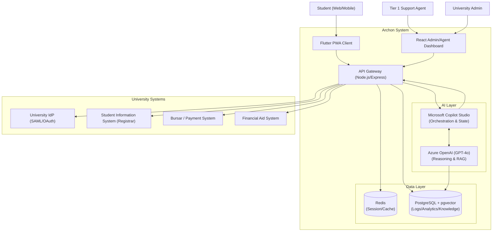

# System Design Document (SDD)

**Project:** Archon — Agentic AI-Powered Service Desk for Higher Education
**Date:** 2026-06-07
**Version:** 0.1
**Owner:** Regalia Council (Alaric)
**Status:** Draft
**Last reconciled:** N/A — not yet reconciled with code
**PRD:** [prd-archon.md](prd-archon.md)
**DSD:** [dsd-archon.md](dsd-archon.md)

---

## 1. Architecture Overview

Archon uses a **Hybrid Orchestration Architecture**. It leverages Microsoft Copilot Studio for low-code conversational routing and dialogue management, backed by Azure OpenAI for complex reasoning, and a custom Node.js middleware layer (API Gateway) that handles authentication and acts as the universal adapter to siloed university systems.

This architecture satisfies the PRD's requirement for cross-department data orchestration (`PRD-F2`) while maintaining enterprise-grade security and state management.

---

## 2. High-Level Architecture (C4 Context/Container)

---

## 3. Data Architecture & Schema

Archon is *not* the system of record for student data. It is a real-time orchestration engine. It caches data for the duration of a session and stores anonymized transcripts for analytics and AI training.

**Core Databases:**

1.  **PostgreSQL (Operational Data & Analytics)**
    *   `Users`: Local proxy mapping to University IdP (contains user UUID, preferences, role). No PII stored long-term; pulled via API on session start.
    *   `Conversations`: Ticket/chat metadata (status, assignee, duration).
    *   `Messages`: Transcript logs (PII redacted before insertion).
    *   `Handoffs`: Structured context packets for human escalation.
    *   `VectorStore` (pgvector): Embeddings for university policies, FAQs, and SAP appeal guidelines (used by RAG).
2.  **Redis (Ephemeral State & Rate Limiting)**
    *   Session management (JWT blocklists).
    *   Chat streaming state.
    *   Aggressive caching of university API responses (e.g., student balance cached for 5 minutes to prevent hammering the Bursar API).

---

## 4. API & Interface Contracts

**Internal API (Gateway ↔ Client):**
-   RESTful JSON over HTTPS for standard CRUD operations (Dashboard, Ticket History).
-   WebSockets/Server-Sent Events (SSE) for real-time chat streaming between the Flutter client and the Copilot Studio engine.

**External API (Gateway ↔ University Systems) — The "Adapter Pattern":**
The Node.js Gateway implements an abstract `UniversityAdapter` interface. This allows Archon to connect to disparate systems (Banner, Workday, legacy Oracle DBs) without changing the core AI logic.

*   `getStudentProfile(studentId)` → Unified JSON (Name, Major, SAP Status)
*   `getHolds(studentId)` → Array of hold objects (Department, Reason, Resolution steps)
*   `getFinancialStatus(studentId)` → Object (Balance due, Pending aid, Next deadline)
*   `requestHoldLift(studentId, holdId, reason)` → Executes write action (logs attempt).

---

## 5. Security & Authentication

*   **Authentication:** Archon relies entirely on the partner university's Identity Provider (IdP) via SAML 2.0 or OAuth 2.0/OIDC. Archon does not store passwords.
*   **Authorization:** Role-Based Access Control (RBAC) enforced at the Gateway layer.
    *   `Student`: Can only read/write data associated with their specific `student_id`.
    *   `Agent`: Can read/write data for tickets in their queue.
    *   `Admin`: Can view aggregated analytics (no PII).
*   **Data in Transit:** TLS 1.3 mandated for all connections.
*   **Data at Rest:** AES-256 encryption for the PostgreSQL database.
*   **PII Redaction:** The Gateway scrubs PII (names, specific IDs) using regex/NLP *before* sending conversation transcripts to Azure OpenAI for reasoning, unless the specific AI operation explicitly requires that data (e.g., generating a personalized letter).

---

## 6. Infrastructure & Deployment

*   **Cloud Provider:** Microsoft Azure (Optimized for Copilot Studio and Azure OpenAI).
*   **Compute:** Azure App Service (Node.js Gateway) + Azure Static Web Apps (Flutter PWA, React Dashboard).
*   **Database:** Azure Database for PostgreSQL (Flexible Server) + Azure Cache for Redis.
*   **AI:** Azure AI Studio (Provisioned Throughput Units for GPT-4o if volume demands; Pay-As-You-Go for Alpha/Beta).
*   **CI/CD:** GitHub Actions. Deployments triggered on tag. Infrastructure managed via Terraform.

---

## 7. Non-Functional Requirements (NFRs)

| NFR | Metric / Target | Verification |
|-----|-----------------|--------------|
| **Latency (Chat)** | Time-to-first-token < 3s (3G network). Full resolution < 15s. | Load testing (k6) simulating 3G latency. |
| **Availability** | 99.9% uptime (approx 43m downtime/month). | Azure Monitor synthetic transactions. |
| **Scalability** | Support 500 concurrent chat sessions during peak enrollment weeks. | Load testing (k6). Auto-scaling triggers on App Service. |
| **Data Freshness** | University API data cached for max 5 minutes. Real-time fetch for transaction checks. | Gateway logging. |

---

## 8. AI & Agent Architecture

The AI subsystem handles `PRD-F1` (Agentic Chat), `PRD-F2` (Orchestration), and `PRD-F4` (Handoff).

**Copilot Studio (The Orchestrator):**
-   Manages conversation state, branching logic, and user intent recognition.
-   Handles simple FAQ deflection natively (RAG over university policies).
-   Triggers "Topics" (workflows) based on intent.

**Azure OpenAI (The Reasoner):**
-   Called by Copilot Studio for complex, unstructured tasks.
-   *Example:* Copilot fetches JSON from the Registrar and Bursar APIs. It passes both JSONs to OpenAI with the prompt: *"The student asks why they cannot register. Analyze these two data sources and explain the situation to the student in friendly Filipino."*

**The "Tools" (Agent Actions):**
Copilot Studio is granted specific Tools (HTTP actions) pointing to the Node.js Gateway:
1.  `Tool: CheckStudentHolds`
2.  `Tool: CheckFinancialAidStatus`
3.  `Tool: EscalateToHuman` (Generates the `PRD-F4` handoff packet)

### 8.1 AI Safety & Guardrails (OWASP LLM Controls)

1.  **LLM01: Prompt Injection:** Copilot Studio topics strictly separate user input from system prompts. The Gateway validates user input length and character sets before passing to the AI.
2.  **LLM02: Insecure Output Handling:** AI outputs are treated as untrusted markdown. The Flutter client sanitizes all HTML/Markdown before rendering to prevent XSS.
3.  **LLM06: Sensitive Information Disclosure:** The system prompt explicitly forbids discussing other students' data. RBAC at the Gateway ensures the AI *cannot* fetch data for a `student_id` different from the authenticated user's ID.
4.  **Scope Containment:** The AI is given read-only API access by default. Write actions (e.g., lifting a hold) require explicit human-in-the-loop confirmation via a UI button, bypassing the LLM for the final execution step.

---

## Self-Check

- [x] Specifies the exact stack (Node.js, Postgres, Redis, Flutter, Copilot Studio, Azure OpenAI).
- [x] System diagram maps how the components talk to each other.
- [x] Explains how `PRD-F2` (Data Orchestration) works without storing the university's data.
- [x] Includes NFRs that can be tested (500 concurrent users, 3s TTFT).
- [x] Defines specific AI guardrails, notably the separation of read (AI) and write (Human confirmed) actions.
